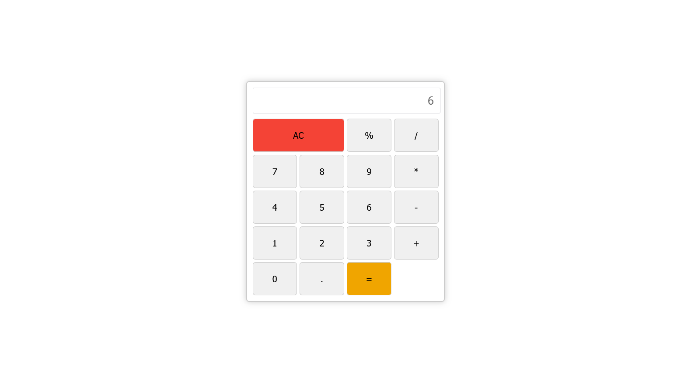

# Simple Calculator

The Simple Calculator is a basic web-based calculator application built using HTML, CSS, and JavaScript. It allows users to perform simple arithmetic operations, including addition, subtraction, multiplication, and division, as well as calculating the modulo (%) and performing the square of a number. It supports both decimal and whole numbers.

## Features

- Addition (+)
- Subtraction (-)
- Multiplication (*)
- Division (/)
- Modulo (%)
- Square of a number
- All Clear (AC) button to clear the current input
- Equal (=) key for performing the operation

## Usage

To use the calculator, follow these steps:

1. Clone this repository or download the project files.

2. Open the `index.html` file in your web browser.

3. The calculator interface will appear with a display for input and buttons for various arithmetic operations and numbers.

### Buttons

- Numeric Buttons: Click on these buttons to enter the corresponding numbers.

- Operation Buttons: Click on these buttons to perform the specified operation (+, -, *, /, %).

- All Clear (AC) Button: Click on this button to clear the current input.

- Equal (=) Button: Click on this button to calculate the result.

## How It Works

1. Type the numbers and operations using the calculator buttons or your keyboard.

2. Once you have entered the desired calculation, press the "=" button to get the result displayed on the screen.

3. To clear the current input, click on the "AC" button.

## Important Note

The calculator uses the JavaScript `eval()` function for calculation, which can be potentially risky in real-world scenarios. For educational purposes, this simple implementation suffices, but it's not recommended for production use without additional validation and security measures.

## Customize and Extend

Feel free to modify and extend the calculator to suit your needs or add additional functionalities. You can improve the UI, add more advanced mathematical operations, or implement user authentication to save calculation history.

## License

This project is licensed under the MIT License - see the [LICENSE](LICENSE) file for details.

---

